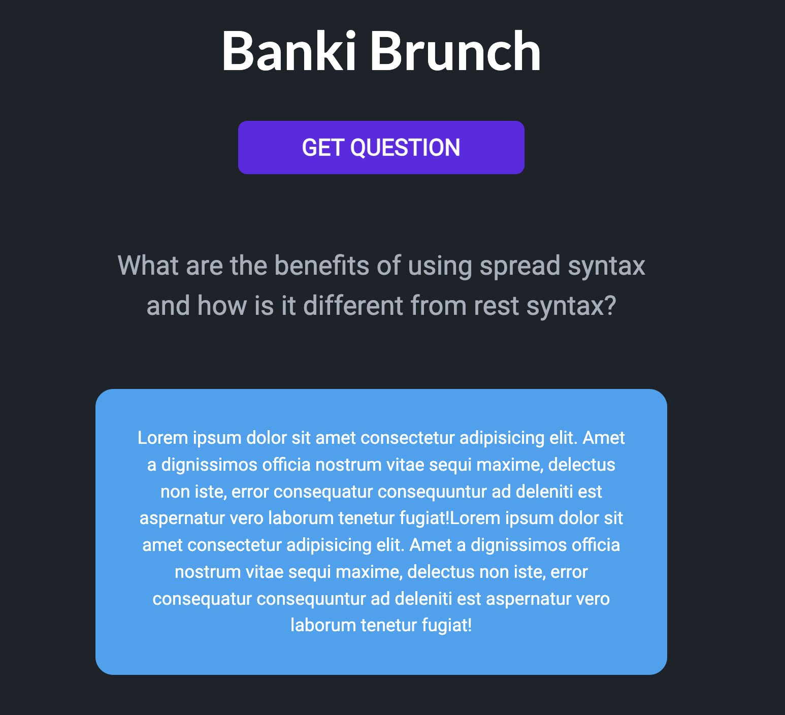

# Banki Brunch

## What Are we building?

A Web App for Banki Brunch to make hosting and crowd sourcing our answers to interview questions easier. We hold standups every saturday at 12:30 PM EST in our sub [Discord Channel] at 100devs.

---

### Current landing page (In Development)



Questions inspired from 100dev's very own, 20jasper's [interview-question-api]

### Development

This App uses [NPM](https://www.npmjs.com/) Node Package Manager to manage it's dependencies and packages.

from the root directory run

```
npm install
```

~~Create a .env file in the server folder and add your values.~~

~~For example:~~

```
 Right now we aren't using any secrets, but we will list references here when the time comes.
```

To Start the app in development mode

```
npm run dev
```

### Database

Currently using dockerized [mongodb](https://hub.docker.com/_/mongo)

**[Docker Desktop](https://www.docker.com/products/docker-desktop/) will need to be installed to run the database**

To bring database up

```
npm run db:up
```

To stop the database

```
npm run db:down
```

## Tech Stack (For now)

### **Front-End**

---

- [Vite] - build tool that aims to provide a faster and leaner development experience for modern web projects.

- [React] - JavaScript front end library.

- [Tailwind CSS] - A utility-first CSS framework packed with classes like flex, pt-4, text-center and rotate-90 that can be composed to build any design, directly in your markup.

- [DaisyUI] - It is simply a plugin for Tailwind CSS, which works on all frameworks and has made development faster, and customizable for developers using pure CSS.

---

### Leon's GitHub workflow

- Creator: Create a new issue

- Dev: Pick an issue

- Dev: Comment agreeing to work on the issue

- Dev: Assign issue to themself

- Dev: Make a branch, named with the issue number and description

- Dev: Make changes, commit changes

- Dev: Make a pull request (PR)

- Creator: Review PR

- Creator: Request changes

- Dev: Complete requested changes, commit and submit PR

- Creator: Approve changes, request merge

- Dev: Merge PR

- Dev: Delete issue-specific branch

- Creator: Close issue

_Credit for list_ : **puffalo**

## Contributing

---

We welcome contributions. Simply fork the repository open a pull request with your changes and [@NickSramcik](https://www.github.com/NickSramcik) will review them.

[tailwind css]: https://tailwindcss.com/docs/guides/vite
[DaisyUI]: https://daisyui.com/
[vite]: https://vitejs.dev/
[mongoose]: https://mongoosejs.com/
[mongodb]: https://www.mongodb.com/atlas/database
[node.js]: http://nodejs.org
[express]: http://expressjs.com
[react]: https://react.dev/
[interview-question-api]: https://github.com/20jasper/interview-question-api
[Discord Channel]: https://discord.com/channels/735923219315425401/1095865515290919062
